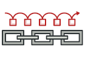

# DESIGN PATTERNS in GO

The Catalog of Go Examples

- Creational Patterns

  - Abstract Factory

  

  Lets you produce families of related objects without specifying their concrete classes.

  [Main article](https://refactoring.guru/design-patterns/abstract-factory)

  [Code example](https://refactoring.guru/design-patterns/abstract-factory/go/example#example-0)

  - Builder

  

  Provides an interface for creating objects in a superclass, but allows subclasses to alter the type of objects that will be created.

  [Main article](https://refactoring.guru/design-patterns/factory-method)

  [Code example](https://refactoring.guru/design-patterns/factory-method/go/example#example-0)

  - Factory Method

  

  Lets you construct complex objects step by step. The pattern allows you to produce different types and representations of an object using the same construction code.

  [Main article](https://refactoring.guru/design-patterns/builder)

  [Code example](https://refactoring.guru/design-patterns/builder/go/example#example-0)

  - Prototype

  

  Lets you copy existing objects without making your code dependent on their classes.

  [Main article](https://refactoring.guru/design-patterns/prototype)

  [Code example](https://refactoring.guru/design-patterns/prototype/go/example#example-0)

  - Singleton

  

  Lets you ensure that a class has only one instance, while providing a global access point to this instance.

  [Main article](https://refactoring.guru/design-patterns/singleton)

  [Code example](https://refactoring.guru/design-patterns/singleton/go/example#example-0)

- Structural Patterns

  - Adapter

  

  Allows objects with incompatible interfaces to collaborate.

  [Main article](https://refactoring.guru/design-patterns/adapter)

  [Code example](https://refactoring.guru/design-patterns/adapter/go/example#example-0)

  - Bridge

  

  Lets you split a large class or a set of closely related classes into two separate hierarchies—abstraction and implementation—which can be developed independently of each other.

  [Main article](https://refactoring.guru/design-patterns/bridge)

  [Code example](https://refactoring.guru/design-patterns/bridge/go/example#example-0)

  - Composite

  

  Lets you compose objects into tree structures and then work with these structures as if they were individual objects.

  [Main article](https://refactoring.guru/design-patterns/composite)

  [Code example](https://refactoring.guru/design-patterns/composite/go/example#example-0)

  - Decorator

  

  Lets you attach new behaviors to objects by placing these objects inside special wrapper objects that contain the behaviors.

  [Main article](https://refactoring.guru/design-patterns/decorator)

  [Code example](https://refactoring.guru/design-patterns/decorator/go/example#example-0)

  - Facade

  

  Provides a simplified interface to a library, a framework, or any other complex set of classes.

  [Main article](https://refactoring.guru/design-patterns/facade)

  [Code example](https://refactoring.guru/design-patterns/facade/go/example#example-0)

  - Flyweight

  

  Lets you fit more objects into the available amount of RAM by sharing common parts of state between multiple objects instead of keeping all of the data in each object.

  [Main article](https://refactoring.guru/design-patterns/flyweight)

  [Code example](https://refactoring.guru/design-patterns/flyweight/go/example#example-0)

  - Proxy

  

  Lets you provide a substitute or placeholder for another object. A proxy controls access to the original object, allowing you to perform something either before or after the request gets through to the original object.

  [Main article](https://refactoring.guru/design-patterns/proxy)

  [Code example](https://refactoring.guru/design-patterns/proxy/go/example#example-0)

- Behavioral Patterns

  - Chain of Responsibility

  

  Lets you pass requests along a chain of handlers. Upon receiving a request, each handler decides either to process the request or to pass it to the next handler in the chain.

  [Main article](https://refactoring.guru/design-patterns/chain-of-responsibility)

  [Code example](https://refactoring.guru/design-patterns/chain-of-responsibility/go/example#example-0)

  - Iterator

  

  Lets you traverse elements of a collection without exposing its underlying representation (list, stack, tree, etc.).

  [Main article](https://refactoring.guru/design-patterns/iterator)

  [Code example](https://refactoring.guru/design-patterns/iterator/go/example#example-0)

  - Memento

  

  Lets you save and restore the previous state of an object without revealing the details of its implementation.

  [Main article](https://refactoring.guru/design-patterns/memento)

  [Code example](https://refactoring.guru/design-patterns/memento/go/example#example-0)

  - State

  

  Lets an object alter its behavior when its internal state changes. It appears as if the object changed its class.

  [Main article](https://refactoring.guru/design-patterns/state)

  [Code example](https://refactoring.guru/design-patterns/state/go/example#example-0)

  - Template Method

  

  Defines the skeleton of an algorithm in the superclass but lets subclasses override specific steps of the algorithm without changing its structure.

  [Main article](https://refactoring.guru/design-patterns/template-method)

  [Code example](https://refactoring.guru/design-patterns/template-method/go/example#example-0)

  - Command

  

  Turns a request into a stand-alone object that contains all information about the request. This transformation lets you pass requests as a method arguments, delay or queue a request's execution, and support undoable operations.

  [Main article](https://refactoring.guru/design-patterns/command)

  [Code example](https://refactoring.guru/design-patterns/command/go/example#example-0)

  - Mediator

  

  Lets you reduce chaotic dependencies between objects. The pattern restricts direct communications between the objects and forces them to collaborate only via a mediator object.

  [Main article](https://refactoring.guru/design-patterns/mediator)

  [Code example](https://refactoring.guru/design-patterns/mediator/go/example#example-0)

  - Observer

  

  Lets you define a subscription mechanism to notify multiple objects about any events that happen to the object they're observing.

  [Main article](https://refactoring.guru/design-patterns/observer)

  [Code example](https://refactoring.guru/design-patterns/observer/go/example#example-0)

  - Strategy

  

  Lets you define a family of algorithms, put each of them into a separate class, and make their objects interchangeable.

  [Main article](https://refactoring.guru/design-patterns/strategy)

  [Code example](https://refactoring.guru/design-patterns/strategy/go/example#example-0)

  - Visitor

  

  Lets you separate algorithms from the objects on which they operate.

  [Main article](https://refactoring.guru/design-patterns/visitor)

  [Code example](https://refactoring.guru/design-patterns/visitor/go/example#example-0)

Reference by [REFACTORING GURU](https://refactoring.guru/design-patterns/go)
