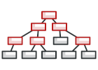

# DESIGN PATTERNS in GO


### The Catalog of Go Examples

- **Creational Patterns**: These patterns provide various object creation mechanisms, which increase flexibility and reuse of existing code.

  - **Abstract Factory**

  

  Lets you produce families of related objects without specifying their concrete classes.

  💬 **Intent**

  **Abstract Factory** is a creational design pattern that lets you produce families of related objects without specifying their concrete classes.

  

  🙁 **Problem**

  Imagine that you’re creating a furniture shop simulator. Your code consists of classes that represent:

  1. A family of related products, say: `Chair` + `Sofa` + `CoffeeTable`.

  2. Several variants of this family. For example, products `Chair` + `Sofa` + `CoffeeTable` are available in these variants: `Modern`, `Victorian`, `ArtDeco`.

  

  > Product families and their variants.

  You need a way to create individual furniture objects so that they match other objects of the same family. Customers get quite mad when they receive non-matching furniture.

  

  > A Modern-style sofa doesn’t match Victorian-style chairs.

  Also, you don’t want to change existing code when adding new products or families of products to the program. Furniture vendors update their catalogs very often, and you wouldn’t want to change the core code each time it happens.

  😎 **Solution**

  The first thing the Abstract Factory pattern suggests is to explicitly declare interfaces for each distinct product of the product family (e.g., chair, sofa or coffee table). Then you can make all variants of products follow those interfaces. For example, all chair variants can implement the `Chair` interface; all coffee table variants can implement the `CoffeeTable` interface, and so on.

  

  > All variants of the same object must be moved to a single class hierarchy.

  The next move is to declare the Abstract Factory—an interface with a list of creation methods for all products that are part of the product family (for example, `createChair`, `createSofa` and `createCoffeeTable`). These methods must return abstract product types represented by the interfaces we extracted previously: `Chair`, `Sofa`, `CoffeeTable` and so on.

  

  > Each concrete factory corresponds to a specific product variant.

  Now, how about the product variants? For each variant of a product family, we create a separate factory class based on the `AbstractFactory` interface. A factory is a class that returns products of a particular kind. For example, the `ModernFurnitureFactory` can only create `ModernChair`, `ModernSofa` and `ModernCoffeeTable` objects.

  The client code has to work with both factories and products via their respective abstract interfaces. This lets you change the type of a factory that you pass to the client code, as well as the product variant that the client code receives, without breaking the actual client code.

  

  > The client shouldn’t care about the concrete class of the factory it works with.

  Say the client wants a factory to produce a chair. The client doesn’t have to be aware of the factory’s class, nor does it matter what kind of chair it gets. Whether it’s a Modern model or a Victorian-style chair, the client must treat all chairs in the same manner, using the abstract `Chair` interface. With this approach, the only thing that the client knows about the chair is that it implements the `sitOn` method in some way. Also, whichever variant of the chair is returned, it’ll always match the type of sofa or coffee table produced by the same factory object.

  There’s one more thing left to clarify: if the client is only exposed to the abstract interfaces, what creates the actual factory objects? Usually, the application creates a concrete factory object at the initialization stage. Just before that, the app must select the factory type depending on the configuration or the environment settings.

  [For more on this article...](https://refactoring.guru/design-patterns/abstract-factory)

  💅 **Conceptual Example**

  Say, you need to buy a sports kit, a set of two different products: a pair of shoes and a shirt. You would want to buy a full sports kit of the same brand to match all the items.

  If we try to turn this into code, the abstract factory will help us create sets of products so that they would always match each other.

  ✍ **iSportsFactory.go: Abstract factory interface**

  ```go
  package abstractfactory

  import "fmt"

  type ISportsFactory interface {
    makeShoe() IShoe
    makeShirt() IShirt
  }

  func GetSportsFactory(brand string) (ISportsFactory, error) {
    if brand == "adidas" {
      return &Adidas{}, nil
    }

    if brand == "nike" {
      return &Nike{}, nil
    }

    return nil, fmt.Errorf("Wrong brand type passed")
  }
  ```

  ✍ **adidas.go: Concrete factory**

  ```go
  package abstractfactory

  type Adidas struct {

  }

  func (a *Adidas) makeShoe() IShoe {
    return &AdidasShoe{
      Shoe: Shoe{
        logo: "adidas",
        size: 14,
      },
    }
  }

  func (a *Adidas) makeShirt() IShirt {
    return &AdidasShirt{
      Shirt: Shirt{
        logo: "adidas",
        size: 14,
      },
    }
  }
  ```

  ✍ **nike.go: Concrete factory**

  ```go
  package abstractfactory

  type Nike struct {

  }

  func (n *Nike) makeShoe() IShoe {
    return &NikeShoe{
      Shoe: Shoe{
        logo: "nike",
        size: 14,
      },
    }
  }

  func (n *Nike) makeShirt() IShirt {
    return &NikeShirt{
      Shirt: Shirt{
        logo: "nike",
        size: 14,
      },
    }
  }
  ```

  ✍ **iShoe.go: Abstract product**

  ```go
  package abstractfactory

  type IShoe interface {
    setLogo(_logo string)
    setSize(_size int)
    getLogo() string
    getSize() int
  }

  type Shoe struct {
    logo string
    size int
  }

  func (s *Shoe) setLogo(_logo string) {
    s.logo = _logo
  }

  func (s *Shoe) getLogo() string {
    return s.logo
  }

  func (s *Shoe) setSize(_size int) {
    s.size = _size
  }

  func (s *Shoe) getSize() int {
    return s.size
  }
  ```

  ✍ **adidasShoe.go: Concrete product**

  ```go
  package abstractfactory

  type AdidasShoe struct {
    Shoe
  }
  ```

  ✍ **nikeShoe.go: Concrete product**

  ```go
  package abstractfactory

  type NikeShoe struct {
    Shoe
  }
  ```

  ✍ **iShirt.go: Abstract product**

  ```go
  package abstractfactory

  type IShirt interface {
    setLogo(_logo string)
    setSize(_size int)
    getLogo() string
    getSize() int
  }

  type Shirt struct {
    logo string
    size int
  }

  func (s *Shirt) setLogo(_logo string) {
    s.logo = _logo
  }

  func (s *Shirt) getLogo() string {
    return s.logo
  }

  func (s *Shirt) setSize(_size int) {
    s.size = _size
  }

  func (s *Shirt) getSize() int {
    return s.size
  }
  ```

  ✍ **adidasShirt.go: Concrete product**

  ```go
  package abstractfactory

  type AdidasShirt struct {
    Shirt
  }
  ```

  ✍ **main.go: Client code**

  ```go
  package abstractfactory

  import "fmt"

  func AbstractFactoryInitializer() {
    adidasFactory, _ := GetSportsFactory("adidas")
    nikeFactory, _ := GetSportsFactory("nike")

    adidasShoe := adidasFactory.makeShoe()
    adidasShirt := adidasFactory.makeShirt()

    nikeShoe := nikeFactory.makeShoe()
    nikeShirt := nikeFactory.makeShirt()

    printShoeDetails(adidasShoe)
    printShirtDetails(adidasShirt)

    printShoeDetails(nikeShoe)
    printShirtDetails(nikeShirt)
  }

  func printShoeDetails(s IShoe) {
    fmt.Printf("Logo: %s\n", s.getLogo())
    fmt.Printf("Size: %d\n", s.getSize())
  }

  func printShirtDetails(s IShirt) {
    fmt.Printf("Logo: %s\n", s.getLogo())
    fmt.Printf("Size: %d\n", s.getSize())
  }
  ```

  ✍ **main.go: Main Application**

  ```go
  package main

  import (
    "fmt"

    "github.com/codeismine/go-design-pattern/patterns/creational/abstractfactory"
  )

  func main() {
    // Abstract Factory
    printStart("Abstract Factory")
    abstractfactory.AbstractFactoryInitializer()
    printEnd()
  }

  func printStart(title string) {
    fmt.Printf("%s:\n", title)
    fmt.Println("--------------------------")
  }

  func printEnd() {
    fmt.Printf("--------------------------\n\n\n")
  }
  ```

  🗨 **Output**

  ```
  Abstract Factory:
  --------------------------
  Logo: adidas
  Size: 14
  Logo: adidas
  Size: 14
  Logo: nike
  Size: 14
  Logo: nike
  Size: 14
  --------------------------
  ```

  - **Builder**

  

  Provides an interface for creating objects in a superclass, but allows subclasses to alter the type of objects that will be created.

  [Main article](https://refactoring.guru/design-patterns/factory-method)

  [Code example](https://refactoring.guru/design-patterns/factory-method/go/example#example-0)

  - **Factory Method**

  

  Lets you construct complex objects step by step. The pattern allows you to produce different types and representations of an object using the same construction code.

  [Main article](https://refactoring.guru/design-patterns/builder)

  [Code example](https://refactoring.guru/design-patterns/builder/go/example#example-0)

  - **Prototype**

  

  Lets you copy existing objects without making your code dependent on their classes.

  [Main article](https://refactoring.guru/design-patterns/prototype)

  [Code example](https://refactoring.guru/design-patterns/prototype/go/example#example-0)

  - **Singleton**

  

  Lets you ensure that a class has only one instance, while providing a global access point to this instance.

  [Main article](https://refactoring.guru/design-patterns/singleton)

  [Code example](https://refactoring.guru/design-patterns/singleton/go/example#example-0)

- **Structural Patterns**: These patterns explain how to assemble objects and classes into larger structures while keeping these structures flexible and efficient.

  - **Adapter**

  

  Allows objects with incompatible interfaces to collaborate.

  [Main article](https://refactoring.guru/design-patterns/adapter)

  [Code example](https://refactoring.guru/design-patterns/adapter/go/example#example-0)

  - **Bridge**

  

  Lets you split a large class or a set of closely related classes into two separate hierarchies—abstraction and implementation—which can be developed independently of each other.

  [Main article](https://refactoring.guru/design-patterns/bridge)

  [Code example](https://refactoring.guru/design-patterns/bridge/go/example#example-0)

  - **Composite**

  

  Lets you compose objects into tree structures and then work with these structures as if they were individual objects.

  [Main article](https://refactoring.guru/design-patterns/composite)

  [Code example](https://refactoring.guru/design-patterns/composite/go/example#example-0)

  - **Decorator**

  

  Lets you attach new behaviors to objects by placing these objects inside special wrapper objects that contain the behaviors.

  [Main article](https://refactoring.guru/design-patterns/decorator)

  [Code example](https://refactoring.guru/design-patterns/decorator/go/example#example-0)

  - **Facade**

  

  Provides a simplified interface to a library, a framework, or any other complex set of classes.

  [Main article](https://refactoring.guru/design-patterns/facade)

  [Code example](https://refactoring.guru/design-patterns/facade/go/example#example-0)

  - **Flyweight**

  

  Lets you fit more objects into the available amount of RAM by sharing common parts of state between multiple objects instead of keeping all of the data in each object.

  [Main article](https://refactoring.guru/design-patterns/flyweight)

  [Code example](https://refactoring.guru/design-patterns/flyweight/go/example#example-0)

  - **Proxy**

  

  Lets you provide a substitute or placeholder for another object. A proxy controls access to the original object, allowing you to perform something either before or after the request gets through to the original object.

  [Main article](https://refactoring.guru/design-patterns/proxy)

  [Code example](https://refactoring.guru/design-patterns/proxy/go/example#example-0)

- **Behavioral Patterns**: These patterns are concerned with algorithms and the assignment of responsibilities between objects.

  - **Chain of Responsibility**

  

  Lets you pass requests along a chain of handlers. Upon receiving a request, each handler decides either to process the request or to pass it to the next handler in the chain.

  [Main article](https://refactoring.guru/design-patterns/chain-of-responsibility)

  [Code example](https://refactoring.guru/design-patterns/chain-of-responsibility/go/example#example-0)

  - **Command**

  

  Turns a request into a stand-alone object that contains all information about the request. This transformation lets you pass requests as a method arguments, delay or queue a request's execution, and support undoable operations.

  [Main article](https://refactoring.guru/design-patterns/command)

  [Code example](https://refactoring.guru/design-patterns/command/go/example#example-0)

  - **Iterator**

  

  Lets you traverse elements of a collection without exposing its underlying representation (list, stack, tree, etc.).

  [Main article](https://refactoring.guru/design-patterns/iterator)

  [Code example](https://refactoring.guru/design-patterns/iterator/go/example#example-0)

  - **Mediator**

  

  Lets you reduce chaotic dependencies between objects. The pattern restricts direct communications between the objects and forces them to collaborate only via a mediator object.

  [Main article](https://refactoring.guru/design-patterns/mediator)

  [Code example](https://refactoring.guru/design-patterns/mediator/go/example#example-0)

  - **Memento**

  

  Lets you save and restore the previous state of an object without revealing the details of its implementation.

  [Main article](https://refactoring.guru/design-patterns/memento)

  [Code example](https://refactoring.guru/design-patterns/memento/go/example#example-0)

  - **Observer**

  

  Lets you define a subscription mechanism to notify multiple objects about any events that happen to the object they're observing.

  [Main article](https://refactoring.guru/design-patterns/observer)

  [Code example](https://refactoring.guru/design-patterns/observer/go/example#example-0)

  - **State**

  

  Lets an object alter its behavior when its internal state changes. It appears as if the object changed its class.

  [Main article](https://refactoring.guru/design-patterns/state)

  [Code example](https://refactoring.guru/design-patterns/state/go/example#example-0)

  - **Strategy**

  

  Lets you define a family of algorithms, put each of them into a separate class, and make their objects interchangeable.

  [Main article](https://refactoring.guru/design-patterns/strategy)

  [Code example](https://refactoring.guru/design-patterns/strategy/go/example#example-0)

  - **Template Method**

  

  Defines the skeleton of an algorithm in the superclass but lets subclasses override specific steps of the algorithm without changing its structure.

  [Main article](https://refactoring.guru/design-patterns/template-method)

  [Code example](https://refactoring.guru/design-patterns/template-method/go/example#example-0)

  - **Visitor**

  

  Lets you separate algorithms from the objects on which they operate.

  [Main article](https://refactoring.guru/design-patterns/visitor)

  [Code example](https://refactoring.guru/design-patterns/visitor/go/example#example-0)

Reference by [REFACTORING GURU](https://refactoring.guru/design-patterns/go)
